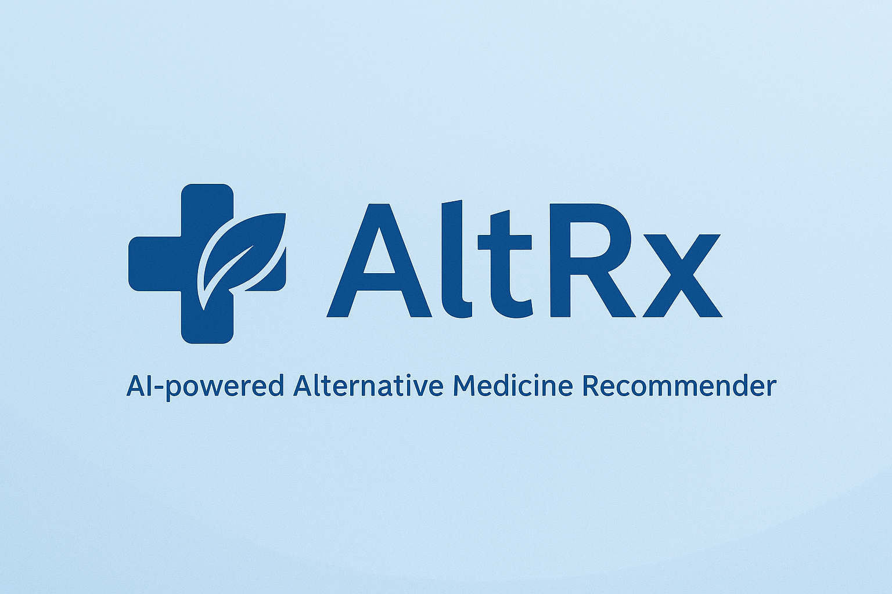
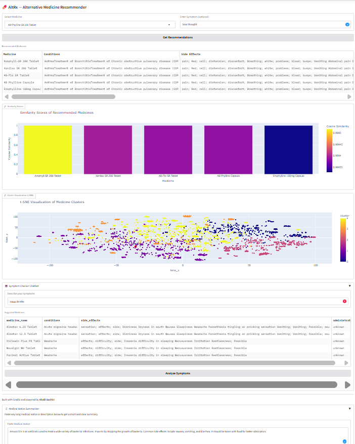

<p align="center">
  
</p>

# 💊 AltRx: AI-Powered Medicine Recommender with LLM-Based Symptom Analysis, Summarization & Clustering

AltRx is an AI-driven application that recommends alternative medicines based on semantic similarity, symptom interpretation, and side-effect profiling.  
It integrates advanced **Natural Language Processing (NLP)**, **Large Language Models (LLMs)**, and **interactive visualization** — all accessible through an intuitive Gradio web interface.

---

## 🚀 Features
```bash
- 🔎 **Hybrid medicine recommendation** using BERT embeddings and cosine similarity.
- 💬 **Symptom Checker Chatbot** powered by a DistilGPT2 LLM to understand symptoms and suggest treatments.
- 📄 **Medical Notice Summarizer** using DistilBART to simplify long drug descriptions.
- 📊 **t-SNE-based clustering** to explore groups of similar medicines visually.
- 🌍 **Multilingual support** with automatic translation of symptoms from French to English.
- 🧠 Built with Transformers, spaCy, scikit-learn, Plotly, and Gradio.

---

## 🖼️ Demo Screenshots

### Main Recommendation Interface


### Symptom Checker Example (input in French)

Input: fièvre, toux, fatigue
Output: Recommends medicines treating flu and respiratory conditions.

🗂️ Project Structure

├── alt_rx_preprocessing.py    # Data processing, embedding, and clustering pipeline
├── app.py                     # Main Gradio application
├── LOGO.png                   # Project logo
├── screenshot.png             # Interface demo image
├── bert_embeddings.pkl        # Medicine embeddings
├── cosine_sim.pkl             # Cosine similarity matrix
├── processed_df.pkl           # Preprocessed medicine dataset
├── medicine_details.csv       # Raw dataset of medicines
├── requirements.txt           # All required Python packages
└── README.md                  # This file

⚙️ Installation
1. Clone the repository

git clone https://github.com/Khalil-BACHIRI/AltRx.git
cd AltRx


2. Create a virtual environment

python -m venv venv
venv\Scripts\activate       # On Windows
# or
source venv/bin/activate    # On macOS/Linux


3. Install dependencies  
```bash
pip install -r requirements.txt  
python -m spacy download en_core_web_sm

🧪 How to Use
Step 1 — Preprocess the data

python alt_rx_preprocessing.py

This generates:

processed_df.pkl

bert_embeddings.pkl

cosine_sim.pkl

Step 2 — Launch the app

python app.py

Then open browser at: http://localhost:7860

🧠 Technologies Used

Tool	Purpose

spaCy	Entity extraction and text preprocessing

Transformers	BERT (for embeddings), DistilGPT2, BART

scikit-learn	Similarity, clustering, and t-SNE

Plotly	Interactive cluster visualizations

Gradio	Web interface

deep-translator	Translate symptoms from French to English

GPU processeur

✨ Example Use Cases

Recommending drug alternatives for specific conditions

Providing medication suggestions from symptom descriptions

Summarizing medical notices for patient-friendly language

Visualizing therapeutic similarity between drugs

📌 Notes

The input dataset must be in medicine_details.csv format.

Summary generation and chatbot use lightweight models to avoid deployment overhead.

Compatible with both CPU and GPU environments.

🧑‍💻 Author

Original project by Khalil BACHIRI

Contact khalil.bachiri@cyu.fr